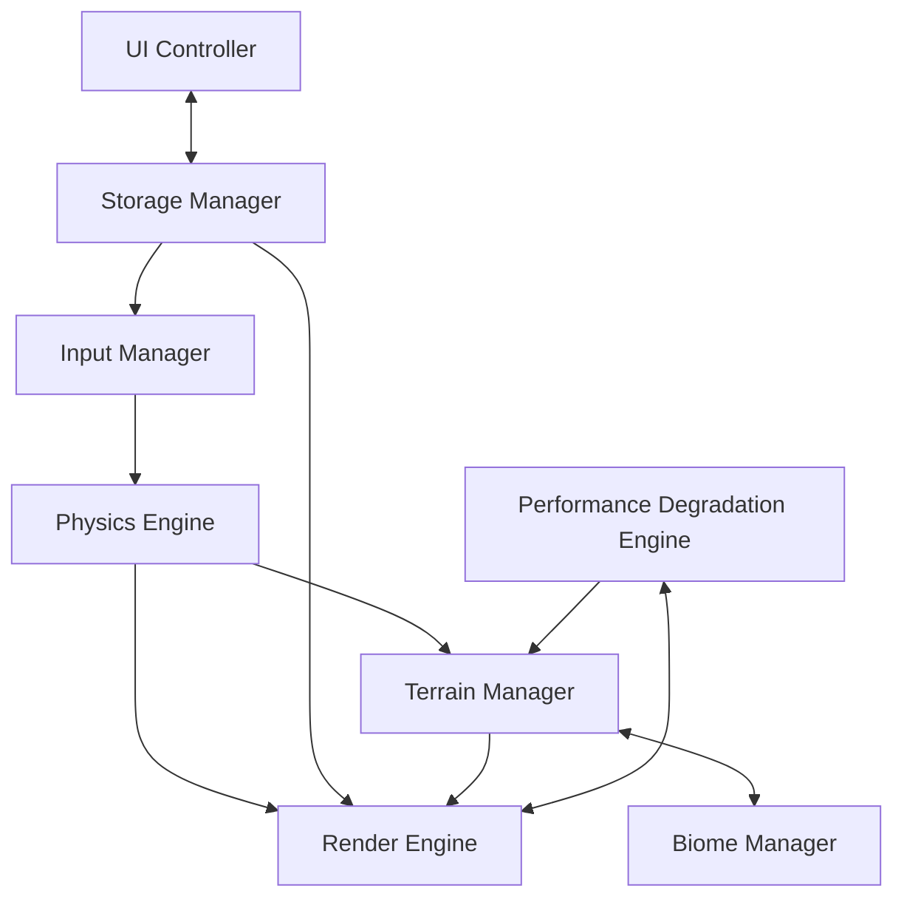
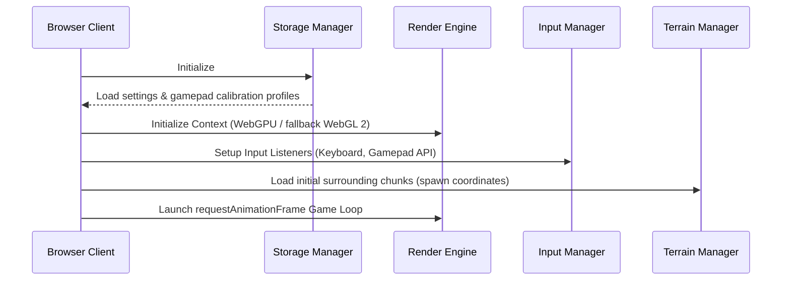
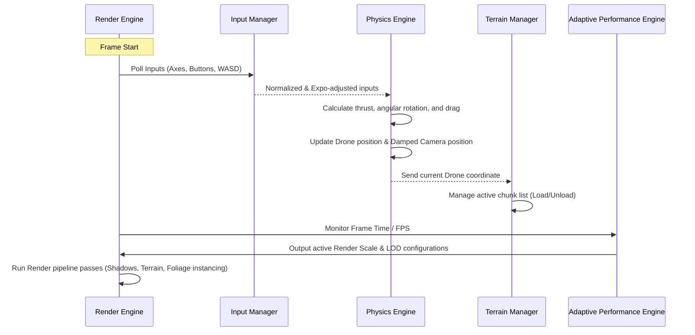

# Technical Architecture: Sky Scape

This document describes the complete technical architecture for **Sky Scape**, an infinite, generative, pure-frontend FPV drone flight simulator.

---

## 1. System Topology & Module Decomposition

Sky Scape is structured as a client-side modular application running entirely in the browser. The architecture decouples device inputs, physical state updates, terrain generation, and rendering to ensure stable performance and ease of testability.

### Module Topology



### Module Breakdown

| Module | Core Responsibility | Key Components |
|---|---|---|
| **Render Engine** | Orchestrates WebGPU/WebGL 2 contexts, lights, camera, and the requestAnimationFrame loop. | `WebGLContext`, `WebGPUContext`, `SceneManager` |
| **Input Manager** | Polls keyboard, mouse, and gamepads via the Gamepad API. Runs the calibration wizard. | `KeyboardMouseInput`, `GamepadInput`, `Calibrator` |
| **Physics Engine** | Calculates momentum, angular drag, linear inertia, gravity, and updates drone position. | `FPVPhysicsEngine`, `DampingCalculator` |
| **Terrain Manager** | Tracks drone position, streams/uncaches 64x64 chunks, triggers height generation. | `ChunkManager`, `LODPlanner`, `MeshGenerator` |
| **Biome Manager** | Provides noise parameters, color configurations, and foliage instances details per biome. | `BiomeConfig`, `FoliagePlanner` |
| **Performance Engine** | Monitors FPS. Dynamically adjusts render distance, resolution, and details to maintain 60 FPS. | `AdaptivePerformanceEngine`, `FPSMonitor` |
| **Storage Manager** | Persists user settings, calibration matrices, and selected biome in LocalStorage. | `LocalStorageManager` |

---

## 2. Module Responsibilities

### 2.1 Render Engine
- Establishes the graphics context. Attempt WebGPU first; fallback to WebGL 2.0 if WebGPU initialization fails.
- Runs the render loop. Controls frame clearing, shadow mapping passes, and main viewport presentation.
- Supports dynamically changing viewport render scaling (e.g., down to 75% or 50% width/height).

### 2.2 Input Manager
- Polls raw input states at the start of the frame.
- Applies standard Expo curves and rates to stick axes before passing to physics:
  \[
  \text{Output} = \text{Input} \times (1 - \text{Expo}) + \text{Input}^3 \times \text{Expo}
  \]
- Coordinates stick configuration mapping. Translates gamepad axes indexes to Throttle, Yaw, Pitch, and Roll.

### 2.3 Physics Engine
- Solves drone FPV movement equations using Euler integration.
- Supports momentum coasting: the drone moves along its velocity vector even when throttle is cut.
- Calculates camera damping using an interpolator to simulate camera mounts on heavy frames:
  \[
  \vec{C}_{\text{pos}} = \text{lerp}(\vec{C}_{\text{pos}}, \vec{D}_{\text{pos}} - \vec{D}_{\text{forward}} \times d_{\text{dist}}, \alpha)
  \]
- Handles slide-bounce terrain collisions: if height drops below terrain elevation, push position up and scale down velocity instead of stopping.

### 2.4 Terrain Manager
- Tracks the active chunk index based on the drone's position:
  \[
  C_x = \lfloor P_x / 64 \rfloor, \quad C_z = \lfloor P_z / 64 \rfloor
  \]
- Maintains an active chunk cache (hashmap key: `"x,z"`). Loads newly entered chunks, unloads chunks out of the active radius.
- Computes vertex height displacements from procedural noise maps.

### 2.5 Biome Manager
- Provides noise mathematical parameters (octaves, frequency, persistence, domain warping) for the active biome.
- Configures biome-specific color lookup tables (passed to GPU shaders as uniforms).
- Manages instanced details (trees, rocks, grass) using deterministic PRNG seeds per chunk:
  ```typescript
  function chunkRandom(cx: number, cz: number, seed: number) {
      const x = Math.sin(cx * 12.9898 + cz * 78.233 + seed) * 43758.5453;
      return x - Math.floor(x);
  }
  ```

### 2.6 Performance Engine
- Measures frame times and computes rolling average FPS every 1 second.
- Manages three levels of degradation targets, scaling back parameters sequentially if FPS is unstable.
- Slowly restores quality when average performance remains high and stable.

### 2.7 Storage Manager
- Reads and updates JSON-serialized user configurations.
- Implements transaction-like saving to LocalStorage to prevent corrupted records from breaking application startup.

---

## 3. Data Flow & Lifecycles

### 3.1 Startup Flow



### 3.2 Game Loop Step Flow



---

## 4. Procedural Terrain Rendering Strategy

To support infinite chunk streaming at 60 FPS, all noise algorithms are executed directly on the GPU.

### 4.1 WebGPU Pipeline (Primary)
- **Heightmap Compute Shader:** A compute shader is run for newly streamed chunks. It calculates multi-octave Simplex noise with domain warping and writes to a GPU texture.
- **Mesh Offsets:** The vertex shader reads the generated texture to displace a static 64x64 plane mesh.
- **Indirect Drawing:** Foliage instance positions are populated by a compute pass directly into GPU buffers, bypassing CPU instancing calls.

### 4.2 WebGL 2.0 Pipeline (Fallback)
- **GPU Fragment Shader Displacement:**
  - Standard JavaScript noise calculation is too slow for real-time 60 FPS mobile rendering.
  - To avoid CPU bottlenecks, we render the noise to an offscreen Framebuffer Object (FBO) using a 2D fragment shader.
  - The output texture is bound to the terrain material. The vertex shader uses `texture2DLod()` inside the vertex shader to offset the vertices of a plane mesh dynamically.
- **Foliage Instancing:** Instance positions are calculated deterministically on the CPU during chunk setup using chunk-based seeding, then populated into instanced vertex attributes.

### 4.3 Shader Noise Model
The terrain uses a combination of low-frequency macro noise and high-frequency micro noise:
```glsl
// GLSL noise formulation example
float getTerrainHeight(vec2 pos) {
    // Macro terrain
    float h = fbm_low(pos * 0.0001) * 300.0;
    
    // Domain warp
    vec2 warp = vec2(fbm_low(pos * 0.0005), fbm_low(pos * 0.0005 + 1.0));
    pos += warp * 50.0;
    
    // Micro details
    h += fbm_high(pos * 0.005) * 15.0;
    return h;
}
```

---

## 5. Adaptive Performance Degradation Engine (APDE)

The APDE is structured as a state machine managing four performance states:

```
[State 0: High] --(FPS < 55 for 3s)--> [State 1: Mid] --(FPS < 50 for 3s)--> [State 2: Low] --(FPS < 45 for 3s)--> [State 3: Ultra-Low]
      ^                                      |                                  |
      |-------------(FPS > 58 for 10s)-------|----------------------------------|
```

### Performance States Configuration

| Parameter | State 0 (High) | State 1 (Mid) | State 2 (Low) | State 3 (Ultra-Low) |
|---|---|---|---|---|
| **Render Distance (PC)** | 8x8 chunks | 6x6 chunks | 4x4 chunks | 3x3 chunks |
| **Render Distance (Mobile)** | 4x4 chunks | 3x3 chunks | 3x3 chunks | 2x2 chunks |
| **Render Scale** | 100% | 100% | 75% | 50% |
| **Shadow Maps** | Enabled (High Res) | Enabled (Low Res) | Disabled | Disabled |
| **Foliage Density** | 100% | 50% | 20% | 0% |
| **Water Waves detail** | Multi-Gerstner (4) | Simple Gerstner (2) | Sine wave approx | Flat plane |

---

## 6. Deployment & Constraints

- **Static Deployment:** The application builds into standard static files and deploys to Cloudflare Pages.
- **No API Calls:** The application runs fully client-side. It does not fetch external map resources, maintaining complete functionality offline.
- **Offline PWA:** Service worker configurations cache the main bundle (`index.html`, `main.js`, CSS) alongside fonts and local biome definitions.
- **Local Persistence:** LocalStorage keys protect data. No personal data is captured or transmitted, resolving GDPR requirements by design.
