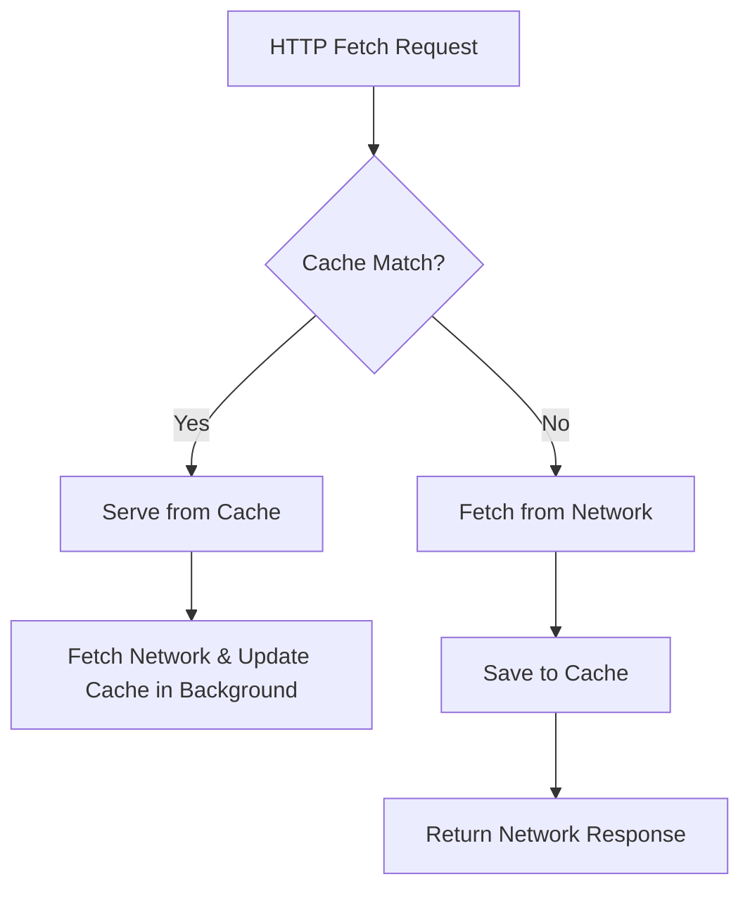

# Local Storage & Caching Schema: Sky Scape

Since Sky Scape utilizes a **Zero-Backend Architecture**, it does not use a remote database. Instead, client state persistence, calibrations, and offline asset caches are managed locally via browser APIs: LocalStorage and the Cache API (Service Worker).

---

## 1. LocalStorage Schema

All user settings, calibrations, and preferences are stored as JSON strings in the browser's `window.localStorage`.

### 1.1 User Settings Profile
- **Key:** `skyscape_user_settings`
- **Description:** Stores interface selections, flight speed limits, physics tuning, and graphics mode choices.

```json
{
  "$schema": "http://json-schema.org/draft-07/schema#",
  "title": "UserSettings",
  "type": "object",
  "properties": {
    "biomeName": {
      "type": "string",
      "enum": ["desert", "forest", "snowland", "coastlines"],
      "default": "forest"
    },
    "graphicsQuality": {
      "type": "string",
      "enum": ["auto", "high", "medium", "low"],
      "default": "auto"
    },
    "cruiseSpeed": {
      "type": "number",
      "minimum": 5.0,
      "maximum": 30.0,
      "default": 15.0
    },
    "cameraDamping": {
      "type": "number",
      "minimum": 0.01,
      "maximum": 1.0,
      "default": 0.15
    },
    "expoFactor": {
      "type": "number",
      "minimum": 0.0,
      "maximum": 1.0,
      "default": 0.4
    }
  },
  "required": ["biomeName", "graphicsQuality", "cruiseSpeed", "cameraDamping", "expoFactor"]
}
```

### 1.2 Gamepad Mappings & Calibration
- **Key:** `skyscape_controller_mappings`
- **Description:** Stores configured channel indexes and inversion flags for USB-connected FPV gimbals/transmitters.

```json
{
  "$schema": "http://json-schema.org/draft-07/schema#",
  "title": "GamepadCalibration",
  "type": "object",
  "properties": {
    "yawAxis": {
      "type": "integer",
      "minimum": 0
    },
    "pitchAxis": {
      "type": "integer",
      "minimum": 0
    },
    "rollAxis": {
      "type": "integer",
      "minimum": 0
    },
    "throttleAxis": {
      "type": "integer",
      "minimum": 0
    },
    "inverted": {
      "type": "object",
      "properties": {
        "yaw": { "type": "boolean" },
        "pitch": { "type": "boolean" },
        "roll": { "type": "boolean" },
        "throttle": { "type": "boolean" }
      },
      "required": ["yaw", "pitch", "roll", "throttle"]
    }
  },
  "required": ["yawAxis", "pitchAxis", "rollAxis", "throttleAxis", "inverted"]
}
```

---

## 2. IndexedDB Chunk Cache (Optional / Future Scope)

If we implement dynamic chunk pre-loading and wish to persist heightmap meshes across reloads to avoid regeneration lag:
- **Database Name:** `skyscape_chunk_db`
- **Store Name:** `terrain_chunks`
- **Key Path:** `coord` (e.g. `"x,z"`)
- **Fields:**
  - `coord`: String (Primary Key)
  - `biome`: String
  - `heightData`: Float32Array (array of 64x64 values)
  - `timestamp`: Number

---

## 3. PWA Offline Caching Strategy

To support 100% offline access as outlined in the PRD, the application installs a Service Worker implementing the Cache API.

### 3.1 Cache Instances
The Service Worker utilizes two named cache buckets:
1. `skyscape-static-v1`: Stores immutable shell assets (HTML, CSS, compiled JS, icons, and UI fonts).
2. `skyscape-procedural-v1`: Stores compiled WGSL/GLSL shader codes.

### 3.2 Service Worker Event Behaviors



- **Lifecycle Strategy (Stale-While-Revalidate):**
  - High-priority assets (scripts and styles) are loaded from the cache immediately to meet the sub-3-second load requirement.
  - In the background, the Service Worker polls the network. If an updated bundle is found, it updates the cache and alerts the client via a postMessage event (`'sw-updated'`), enabling a "New version available. Refresh to update" banner.
- **Cache Manifest Checklist:**
  - `/index.html`
  - `/assets/index.js`
  - `/assets/index.css`
  - `/manifest.webmanifest`
  - `/favicon.ico`
  - `/assets/icons/icon-192.png`
  - `/assets/icons/icon-512.png`
