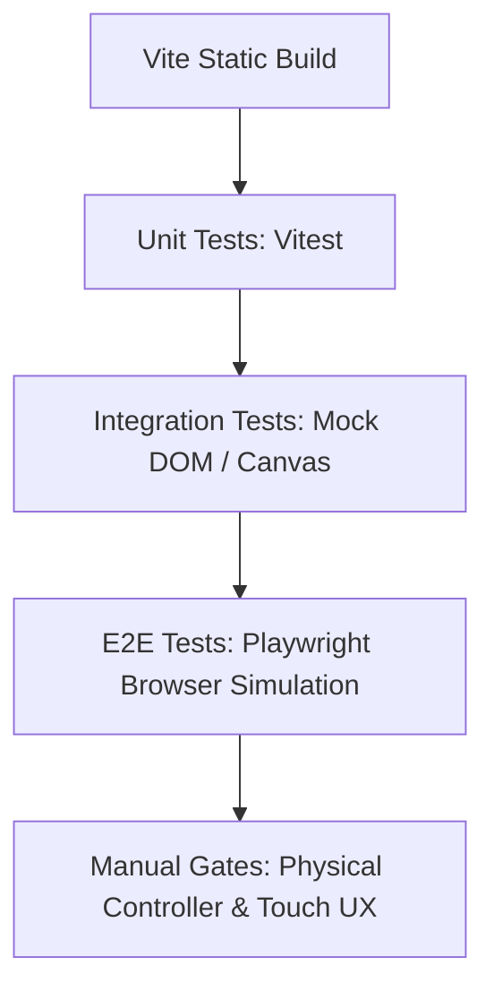

# Test Strategy: Sky Scape

## 1. Document Overview & Objective

This document defines the comprehensive QA test strategy for **Sky Scape**, an infinite, generative, pure-frontend FPV drone flight simulator. The objective is to establish testing guidelines, structure verification phases, outline the automation strategy (leveraging Playwright for E2E validation), and establish release quality gates.

---

## 2. Test Levels & Scope

To ensure correctness and maintain the 60 FPS performance benchmark, testing is divided into four distinct levels:

### 2.1 Unit Testing (Specification Only)
*   **Scope:** Logic verification of isolated math helper libraries, coordinate conversion functions, input parsing, physics calculations, and LocalStorage save/load serialization.
*   **Automation:** Automated via **Vitest** (or Jest).
*   **Focus Areas:**
    *   Expo calculation formula correctness.
    *   Linear/angular damping formulas.
    *   Chunk ID coordinates parsing (`x,z` hashing).
    *   Settings data validation against local JSON schema limits.
    *   Autopilot cruise speed vector mapping.

### 2.2 Integration Testing
*   **Scope:** Verification of boundary interactions between key application modules.
*   **Automation:** Integrated test cases running in a simulated DOM environment or mocked rendering framework.
*   **Focus Areas:**
    *   **Input Manager ↔ Physics Engine:** Correct mapping of gamepad inputs/keyboard strokes to target physics force vectors.
    *   **Terrain Manager ↔ Biome Config:** Correct retrieval of biome configs and application to procedural generation noise seeds.
    *   **Storage Manager ↔ Input Manager:** Calibration profiles successfully loaded from LocalStorage and applied to active gamepad stick mappings.
    *   **Adaptive Performance Degradation Engine (APDE) ↔ Render Engine:** Viewport scaling, draw distance adjustments, and shadow/detail toggles dynamically applying to the active Three.js canvas.

### 2.3 System Testing
*   **Scope:** Full-app capability validation, graphics fallback mechanisms, and PWA capability validation.
*   **Methodology:** Automated browser tests and manual cross-device testing.
*   **Focus Areas:**
    *   **Graphics Fallback:** Automatic mount of WebGL 2.0 rendering context when WebGPU is unavailable or disabled.
    *   **PWA Caching & Offline Launch:** Verification that the app loads in < 3s offline after the initial visit.
    *   **Performance Stability:** Measuring frame rates under simulated load spikes.

### 2.4 End-to-End (E2E) Testing
*   **Scope:** User-centric journey validation simulating actual stick inputs, camera movements, and navigation flows.
*   **Automation:** **Mandatory automation using Playwright** for automated browser simulation, validating canvas rendering, telemetry feedback, and calibration UI wizards before marking E2E cases as successful.
*   **Focus Areas:**
    *   Full calibration sequence mapping from welcome screen to saving profiles.
    *   Mobile virtual joysticks layout mounting, active state opacity, and idle fading behaviors.
    *   Biome selector UI card switching and procedural landscape changes.

---

## 3. Coverage Model & Risk-Based Prioritization

Each feature requirement defined in the Product Requirements Document (PRD) is mapped to a prioritization tier based on business and performance risk.

| Requirement ID | Feature Area | Risk Category | Priority | Key Testing Focus |
|---|---|---|---|---|
| **FR-PHYSICS** | FPV Physics & Camera Engine | System Stability | **Critical** | Stable momentum equations; slide-bounce collision recovery. |
| **FR-INPUT** | Keyboard/Mouse & Mobile Joysticks | Usability | **High** | Virtual joystick touch tracking; key mappings; stick calibration wizard. |
| **FR-TERRAIN** | Procedural Terrain & Biomes | Performance / Graphic | **High** | 60 FPS chunk loading/unloading; procedural biome height and foliage. |
| **FR-PERFORMANCE**| Performance Degradation Engine | Performance / UX | **Critical** | Frame monitoring; automated quality tier shifting (States 0-3); recovery. |
| **FR-UI** | User Interface & Settings | Usability | **Medium** | Settings state persistence; speedometer/altimeter telemetry stability. |
| **NFR-1** | Stable 60 FPS rendering | Performance | **Critical** | Long-duration flight benchmarking (>5 mins) on multiple screen sizes. |
| **NFR-2** | Load Time < 3s | Performance | **High** | Initial bundle parsing speeds and static CDN responsiveness. |
| **NFR-6** | WebGL 2.0 Fallback | Compatibility | **Critical** | Immediate fallback without UI crash overlays. |
| **BR-1/BR-2/BR-3**| Zero-Backend & Privacy Policies | Compliance | **High** | Verification that zero network calls are made for user data/telemetry. |

---

## 4. Automation Strategy

To guarantee the quality of Sky Scape while maintaining a low-friction testing pipeline, the following automation framework is adopted:

### 4.1 Automated vs. Manual Test Scope
*   **Automated (Vitest & Playwright):**
    *   Math formulas, physics state integration, coordinate calculations, and settings persistence.
    *   UI state checks (e.g., joystick idle fading, modal visibility, HUD labels).
    *   Gamepad API mapping logic (using mocked Gamepad inputs via Playwright).
    *   APDE logic verification (mocking lower FPS triggers and verifying that draw distances decrease).
*   **Manual Validation:**
    *   Physical FPV radio controller calibration wizard stick feel.
    *   Physical mobile device thermal and battery drain rates over 15 minutes.
    *   Subjective camera damping motion sickness review (visual comfort assessment).

### 4.2 Playwright Browser Simulator Mandate
All automated E2E tests MUST run inside a Playwright browser simulator instance. The E2E tests are not considered passed until:
1.  Playwright launches the app headlessly and headfully on Chromium, WebKit (Safari), and Firefox.
2.  Playwright simulates pointer/touch events to verify that virtual joysticks react to coordinates.
3.  Playwright mocks gamepad connections and feeds stick axis coordinates to run the calibration steps, validating that the calibration visualizer dot moves correctly and mappings are saved in LocalStorage.
4.  WebGL contexts and GPU canvas objects are loaded without errors in the browser console.

### 4.3 Test-Driven Development (TDD) Guidance for Coding Agents
Downstream coding agents implementing features must:
1.  Write a failing Vitest unit test for any new utility/physics function or a failing Playwright test for any UI interaction before modifying source code.
2.  Write the minimal code necessary to make the test pass.
3.  Refactor while executing the test suite continuously.
4.  Ensure no existing tests are broken.

---

## 5. Quality Gates & Release Readiness

The application must pass the following gates before code can be merged and deployed to production.

### 5.1 Entry Criteria for Testing
- Core code compiles without TypeScript compilation errors.
- Webpack/Vite dev server starts without module import errors.
- Pre-merge formatting (Prettier) and linting (ESLint) pass.

### 5.2 Exit Criteria for Verification
- **Unit Test Pass Rate:** 100% of Vitest tests pass.
- **Integration Test Pass Rate:** 100% of integration checks pass.
- **E2E Automation Pass Rate:** 100% of Playwright browser simulation scenarios pass.
- **Traceability:** Every requirement in the PRD is covered by at least one verified test scenario.

### 5.3 Release Readiness Conditions
- **Lighthouse Performance Score:** > 90/100 on desktop.
- **Frame Rate Target:** Stable 60 FPS maintained for a 5-minute flight on simulated reference devices (low-end laptop and mobile targets).
- **Initial Load Time:** < 3.0 seconds under simulated slow 4G network conditions.
- **GDPR / Privacy Verification:** Network trace inspection confirms zero API queries/data logging calls are sent to any external server.
- **Offline Capability:** The app loads and is interactive when flight mode is active on the device.

---

## 6. Upstream Document Issue Log

During cross-domain verification, the following technical gaps and inconsistencies were identified in the source files:

### Issue 6.1: Collision Detection (CPU) vs. Terrain Displacement (GPU)
*   **Severity:** **CRITICAL**
*   **Source:** [Architecture.md](file:///Users/victorxu/projects/sky_scape/docs/Architecture.md#L65) and [PRD.md](file:///Users/victorxu/projects/sky_scape/docs/PRD.md#L121)
*   **Description:** FPV physics runs on the CPU and requires immediate terrain height lookup at the drone's `(x, z)` coordinates to perform slide-bounce calculations. However, terrain height calculations are designed to run fully on the GPU (WebGPU compute shader or WebGL fragment shader). Doing a GPU-to-CPU readback of heightmaps dynamically inside the 60 FPS loop will cause rendering pipeline stalls and frame drops.
*   **Mitigation Strategy:** The noise algorithm must be duplicated in JavaScript/TypeScript so the CPU can calculate local terrain height instantly. Verification must test that the JS height outputs match the GPU shader height displacements precisely to avoid drone hovering or clipping bugs.

### Issue 6.3: Pitch Input Control Redundancy / Conflict
*   **Severity:** **HIGH**
*   **Source:** [PRD.md](file:///Users/victorxu/projects/sky_scape/docs/PRD.md#L124-L128) and [API_Spec.md](file:///Users/victorxu/projects/sky_scape/docs/API_Spec.md#L14-L23)
*   **Description:** `PRD.md` maps Keyboard `W`/`S` to *Pitch push* and Mouse movement to *Pitch (look up/down) & Yaw (pan)*. Since `DroneInputs` has a single `pitch` value, both mouse Y-axis changes and keyboard inputs fight for the same field.
*   **Mitigation Strategy:** The simulation must clarify the control scheme: either mouse Y is disabled during keyboard mode, or mouse Y adjusts camera pitch angle relative to the drone, while keyboard `W`/`S` controls the drone's movement pitch. The test suite must verify that pitch inputs combine or override each other predictably.

### Issue 6.4: WebGL 2.0 Foliage Placement Height Synchronization
*   **Severity:** **HIGH**
*   **Source:** [Architecture.md](file:///Users/victorxu/projects/sky_scape/docs/Architecture.md#L150-L156)
*   **Description:** In WebGL 2.0 fallback, terrain height is calculated on the GPU via FBO texture mapping. However, foliage instancing positions are calculated on the CPU. The CPU cannot position instanced trees at the correct height without running a duplicate terrain height calculation.
*   **Mitigation Strategy:** Implement a Web Worker that calculates foliage instancing coordinates using a JavaScript port of the noise function, ensuring matching heights. The test cases must explicitly verify that trees do not float above the ground in WebGL 2.0.

### Issue 6.5: UI Individual Stick Expo Curves vs. Single Schema Value
*   **Severity:** **MEDIUM**
*   **Source:** [Screen-Specs.md](file:///Users/victorxu/projects/sky_scape/docs/Screen-Specs.md#L95) and [Database.md](file:///Users/victorxu/projects/sky_scape/docs/Database.md#L43-L47)
*   **Description:** The UI spec lists "Yaw/Pitch/Roll Expo Curves" as individual settings sliders. However, the database schema defines only a single `expoFactor` under `UserSettings`.
*   **Mitigation Strategy:** Update the LocalStorage settings model to support individual expo rates (`yawExpo`, `pitchExpo`, `rollExpo`) to match the user interface.
