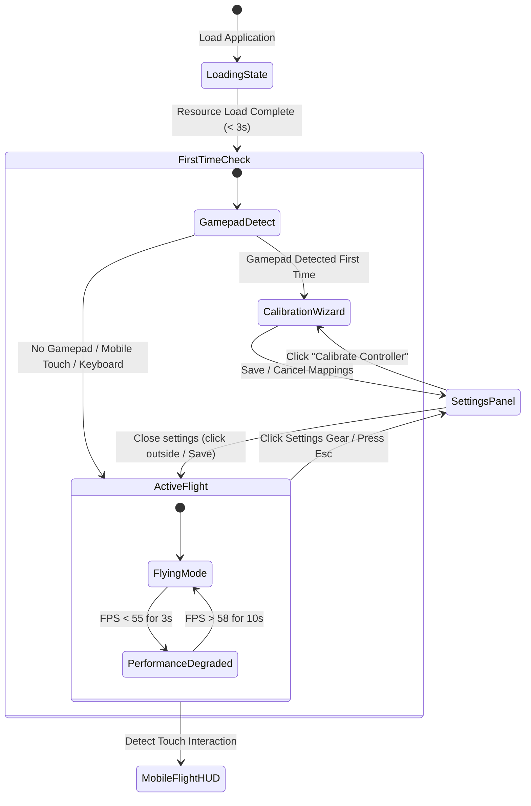

# User Flows: Sky Scape

This document defines the primary user types, entry points, navigation flows, and interactive user journeys for the Sky Scape FPV Drone Simulator. It is optimized for a clean, light-themed visual system with minimal friction.

---

## 1. Overview

Sky Scape is designed for instant, zero-friction access. Users are placed directly into flight upon loading. Mapped configurations (such as controller calibrations and preferences) persist locally.

### Primary User Types

1. **Cinematic FPV Pilots (Claire):** Professional/hobbyist filmmakers practicing smooth sweeping orbits, adjusting speed, and tweaking camera damping/expo curves.
2. **FPV Beginners (Ben):** Novice flyers building raw muscle memory, calibrating physical radio transmitters, and relying on high-expo settings to prevent over-correction.
3. **Zen Gamers (Zach):** Casual explorers looking for a relaxing scenic flight using simple keyboard controls or mobile touch joysticks.

### Key Entry Points

* **Direct Web URL Access:** Instant launch in any modern browser on desktop, tablet, or smartphone.
* **Add-to-Home Screen (PWA):** Launching from the device home screen directly into offline-capable fullscreen flight mode.

---

## 2. Core User Flows & Journeys



---

### Journey 1: Desktop Zen Explorer (Instant Flight & Biome Swap)
**Objective:** Fly instantly, adjust speed, and explore a different biome.

1. **Access:** Zach visits the URL. The loading screen displays a clean, minimalist light-themed progress bar.
2. **Instant Spawn:** Within 3 seconds, Zach is spawned in mid-air at 150m, cruising forward smoothly over a procedural forest.
3. **Control:** Zach flies using the `WASD` keys and pans the camera by moving the mouse.
4. **Speed Modification:** Hovering near the right edge of the screen reveals the floating **Cruise Speed Slider**. Zach drags the slider from `10 m/s` to `25 m/s`. The drone speeds up immediately.
5. **Settings & Biome Shift:**
   * Zach clicks the gear icon in the top-right corner to open the **Settings Panel**.
   * He selects the **Desert** biome from the card-based biome list.
   * The settings panel dims slightly, showing a subtle spinner, while the landscape procedurally shifts from trees to sand dunes.
   * Zach closes the settings pane and continues cruising.

---

### Journey 2: Mobile Touchscreen Explorer (Auto-Fading Joysticks)
**Objective:** Navigate the simulator on an iPad using touch controls with maximum landscape visibility.

1. **Orientation Check:** Zach launches the site on his iPad in landscape mode.
2. **UI Mount:** The system detects touch capabilities and renders two translucent light-mode virtual joysticks at the bottom corners and a vertical height slider on the right edge.
3. **Active Flight:**
   * Zach places his thumbs on the joysticks. The joysticks highlight to full opacity (100%).
   * Left Joystick controls planar movement (forward, backward, strafe left/right).
   * Right Joystick controls rotation (pitch look up/down, yaw look left/right).
   * Right slider changes throttle/altitude velocity.
4. **Idle Fading:**
   * Zach releases his thumbs to let the drone glide on autopilot.
   * After 2.5 seconds of inactivity, the virtual joysticks and slider smoothly transition to a highly transparent idle state (20% opacity).
   * As soon as Zach touches any part of the control areas again, they instantly snap back to 100% opacity.

---

### Journey 3: FPV Pilot Controller Calibration (Multi-Device Calibration Wizard)
**Objective:** Calibrate a physical RadioMaster transmitter, PS/Xbox controller, or DJI RC to practice FPV flight.

1. **Hardware Connection:** Claire plugs her radio transmitter into her computer via USB, then loads the simulator.
2. **First-Time Setup Trigger:**
   * If the app detects a gamepad connection and no previous calibration profile is found in LocalStorage, it prompts: *"New Gamepad Detected! Run Calibration Wizard?"* with option buttons **[Calibrate Now]** and **[Use Keyboard Defaults]**.
   * If she clicks **[Calibrate Now]**, the **Calibration Wizard Overlay** opens.
3. **Multi-Step Axis Mapping Wizard:**
   * **Step 1: Throttle:** Prompt asks: *"Push Throttle Stick Up and Down."* A simple coordinate visualizer shows the active channel movement.
   * **Step 2: Yaw:** Prompt asks: *"Move Yaw Stick Left and Right."*
   * **Step 3: Pitch:** Prompt asks: *"Move Pitch Stick Up and Down."*
   * **Step 4: Roll:** Prompt asks: *"Move Roll Stick Left and Right."*
4. **Live Validation Display:**
   * An interactive crosshair coordinate visualization appears:
     ```
             ↑
             ●  (Dot moves dynamically with Pitch/Roll stick)
     ←               →
             ↓
     ```
   * Horizontal and vertical progress bars show Throttle and Yaw inputs.
   * Claire pushes her sticks and sees the small circle and progress bars move in real-time, verifying correct direction and range.
5. **Save & Exit:** Claire clicks **[Save Mapping]**. Mappings are stored in LocalStorage. The wizard closes, and she starts flying.

---

### Journey 4: Adaptive Performance Degradation (Subtle Visual UI Feedback)
**Objective:** Ensure smooth flight controls when rendering load spikes.

1. **Spike Detected:** During a heavy foliage sweep in the Forest biome, the framerate drops to 52 FPS.
2. **Level 1 Trigger:** After 3 seconds of sub-55 FPS performance:
   * The simulator decreases the render distance radius and increases the fog thickness.
   * A subtle, non-intrusive light gray indicator reads: *"Optimizing performance..."* in the bottom-right corner of the HUD.
3. **Recovery:**
   * Once performance rises back to 60 FPS and remains stable for 10 seconds, the indicator fades out.
   * The render distance is slowly restored to its original value.

---

## 3. Navigation Controls & Exceptions

### Exception: Gamepad Disconnected Mid-Flight
* **Trigger:** The FPV controller cable is pulled out.
* **Flow:** The simulator automatically pauses the physics engine, slides down a warning overlay: *"Controller Disconnected. Reconnect controller or press [Escape] to switch to Keyboard mode."*, and waits for user action.

### Pause / Esc Menu Behavior
* Pressing `Esc` or clicking the settings gear immediately displays the Settings Panel.
* The flight physics engine is paused during menus, preventing the drone from flying away or losing position while settings are customized.
